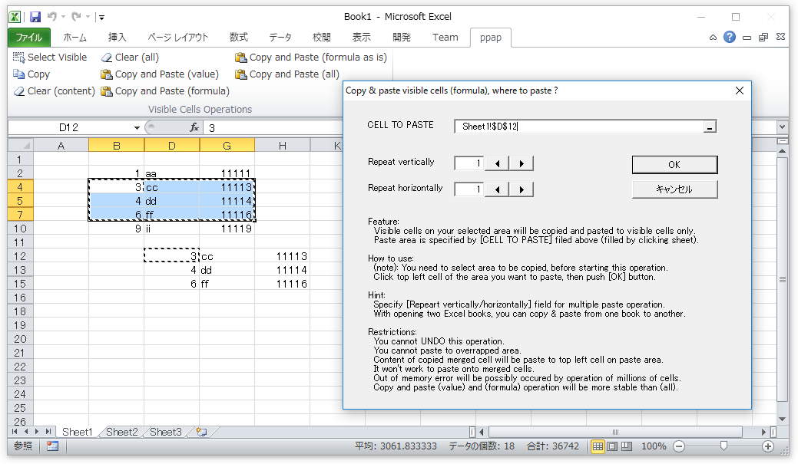

# Excel_addin-copy_and_paste_visible_cells_only

This Excel addin help you copy content of visible cells and paste to visible cells only.

The term "visible cells" here means, cells not hidden by Excel operation such as row hide or column hide.

Generally, copy operation from visible cells is supported by Excel in default, just by hitting Alt+; and ctrl+c on the sheet. However, pasting to visible cells only is little bit tricky. This addin is aimed to support both copying and pasting as one operation with relatively friendly UI.

## UI

## Installation  
Download as zip from this repository. After extract zip, .xlam file in root folder is the addin you need. Please google how to install and enable .xlam addin into your Excel environment.

## Usage
1. select cell area you want to copy from
2. click [Copy and paste (xxx)] ribbon button to launch dialog.
3. click top left cell of the area you want to paste ([CELL TO PASTE] field on the dialog will be filled in).
4. click [OK] button on the dialog to start operation.

## Restrictions
- You cannot UNDO this operation.
- You cannot paste to overwrapped area: Copying area and Pasting area should not be overwrapped.
- Content of copied merged cell will be paste to top left cell on paste area.
- It won't work to paste onto merged cells, currently.
- Out of memory error will be possibly occurred by operation of millions of cells.
- Copy and paste (value) and (formula) operation will be more stable and fast than (all). **Suggest to use copy and paste (value) or (formula) for general purpose.**

## History  
I created this addin years ago with referencing valuable conversations on the forum page below. Originally Japanese UI for personal use only, now I created English UI version as open source contribution.- http://www.mrexcel.com/forum/excel-questions/85288-paste-visible-cells-only-3.html

## Issue report
I used this addin frequently with Excel 2010 ago (for constructing large complex excel formula chain utilizing multicore calculation). I wanna know any other restrictions exist on various kind of operations and environments or not.

## Libraries
Progress bar class:
- http://hp.vector.co.jp/authors/VA033788/kowaza.html#0181

Using vbac.wsf from following vba toolset 'Ariawase' for extracting vba source code before uploading to github.
- https://github.com/vbaidiot/Ariawase  

## License
MIT
